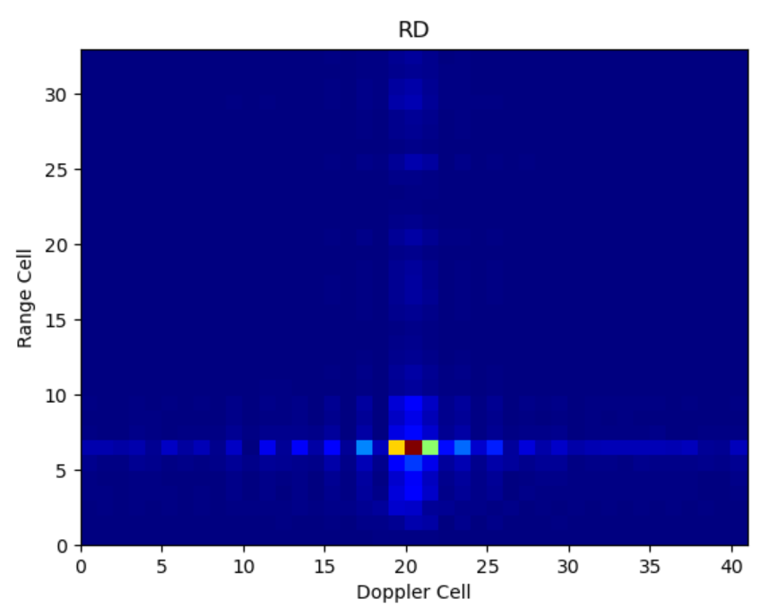

# ISAR Experiment  
Display the data collected from the Network Analyzer in the darkroom.

## Data processing steps
The data processing steps are given as follows:  

1. Call the DP class in the readdata module to read data from the Excel file located at ./data/Book1.xlsx.
2. Perform a transpose operation on the original data so that the columns become samples and the rows become attributes. 
3. Apply FFT transformation to the columns of the original data to obtain a radial spectrum.
4. Apply FFT transformation to the rows of the radial spectrum to obtain the ISAR imaging result.
5. Take logarithm of the ISAR imaging result, and draw it using jet color mapping.

## File analysis by [`Academic_ChatGPT`](https://github.com/binary-husky/chatgpt_academic)
| File Name | File Name |
|--|--|
|`main.py` | Implements the entire process for radar imaging. |
| `readdata.py` | Used to read test data, including methods for reading data from CSV and Excel files, as well as converting data formats. |

## Result
The RD result of a corner reflector:

## License
[MIT](./LICENSE)